**первый остров** · [все острова](../ISLANDS.md) · [общие правила](../ISLANDS.md#1-общие-правила) · [остров 2 →](02-lotus.md)

# ОСТРОВ 1 — ИСМАРА

> Концепция острова, слоты под картинки и промпты к ним. Общие правила — камера,
> свет, контраст, именование файлов — в [ISLANDS.md §1](../ISLANDS.md#1-общие-правила).
> Числа боя живут в `balance.json` и сюда не переносятся.
>
> **Ассетов на остров: 12.**

---

## 1. КОНЦЕПЦИЯ

**id:** `ismaros` · **босс:** Вождь киконов, слабость **рубящий** ·
**биом:** весенний средиземноморский склон, виноградники, разграбленный город

> Ты сжёг этот город час назад. Киконы вернулись с подкреплением из глубины
> страны, и теперь горит уже под тобой.

**Вид.** Сочный зелёный склон, по нему террасами идут виноградники. Внизу
галечный берег и вытащенный на него корабль. Наверху — дым от храма, который
ещё не догорел. Единственный остров, где разрушение свежее: доски ещё тлеют,
амфоры разбиты только что. Это учебный остров, и он обязан быть самым читаемым:
никакого тумана, никаких перекрывающих крон, максимум пустого зелёного поля
вокруг врагов.

**Палитра** (уже настроена, `ground/base.png` готов)

| Роль | Hex |
|---|---|
| трава основная | `#3E7F3F` |
| трава в тени | `#2D5E31` |
| трава на свету | `#4B8C43` |
| олива выгоревшая | `#6E8A4B` |
| сухая охра | `#A8843F` |
| известняк | `#C9C3AE` |
| огонь и угли | `#D9762B` / `#4A3F38` |

**Планировка**

```
┌────────────────┬────────────────┬────────────────┐
│ ТЕРРАСЫ ЛОЗЫ   │ ★ ПЛОЩАДЬ У    │ КРУЧА          │
│ шпалеры рядами │  СГОРЕВШЕГО    │ сигнальный     │
│ ▲ Фрасий       │  ХРАМА         │ костёр         │
│                │  ◆ у ступеней  │ ▲ Тимон        │
├────────────────┼═══════════════─┼────────────────┤
│ ДАВИЛЬНЯ       │ РАЗОРЁННАЯ     │ ОЛИВКОВАЯ МЕЖА │
│ винный пресс   │ ДЕРЕВНЯ        │ овраг          │
│ ▲ Мирон  ◆     │ • • • •        │ ▲ Ксанф  ◆     │
├────────────────┼═══════════════─┼────────────────┤
│ ЛОДОЧНЫЕ САРАИ │ ◎ ГАЛЕЧНЫЙ     │ СГОРЕВШАЯ      │
│ обгорелые      │   БЕРЕГ        │ ПРИСТАНЬ       │
│ • •            │ корабль на     │ ▲ Гарпал  ◆    │
│                │ катках         │ • •            │
└────────────────┴════════════════┴────────────────┘
```

Дорога идёт от корабля вверх через деревню к площади храма — прямая, широкая,
мощёная. На первом острове она должна быть буквальной инструкцией «иди туда».

> **Эта схема исполняемая.** Её машинная форма — `islands/01-ismaros.layout.json`:
> зоны, точка высадки, арена и точки вождей в долях мира. Игра читает именно
> её (`src/world/Layout.ts`), поэтому правка схемы здесь без правки json'а
> ничего не изменит на экране.

**Пять мини-боссов** (правило дропа: два узла роняют копии слабого для босса
типа, чтобы адрес гринда лежал на том же острове)

| Имя | Копии | Где |
|---|---|---|
| Фрасий Секира | рубящий | верхняя терраса виноградника |
| Тимон Костровой | рубящий | у сигнального костра на круче |
| Гарпал Двудротик | колющий | сгоревшая пристань |
| Ксанф Пращник | колющий | овраг у межи |
| Мирон Молот | дробящий | винный пресс |

**Объекты**

| Файл | Размер в мире | Что это |
|---|---|---|
| `ground/ismaros.png` | тайл 512 | **готово** — это текущий `base.png`, переименовать |
| `road/ismaros.png` | тайл 128 | мощёная просёлочная дорога |
| `borders/ismaros.png` | 512×256 | сухая каменная кладка с виноградными кольями |
| `props/vine-trellis.png` | в 70 | шпалера: лоза на кольях, гроздья |
| `props/wine-press.png` | ш 60 | каменная давильня с жёлобом |
| `props/cart-broken.png` | ш 55 | опрокинутая телега, колесо сорвано |
| `props/palisade-burnt.png` | в 60 | обгорелый частокол, звено |
| `props/hut-burnt.png` | в 85 | сгоревшая хижина, кровля провалилась |
| переиспользуются | | колонна, обломок колонны, барабан, ворота, амфора, валун, щебень, костёр |

**Враги — киконы, фракийские налётчики**

- **Обычный (36).** Босой воин в короткой шерстяной зире с зигзагом по кромке,
  лисья шапка `alopekis` мехом наружу, плетёный полумесяцем щит-пельта за
  спиной. Тело почти чёрное, единственный цвет — красная кромка плаща.
- **Элита (48).** Тот же костюм плюс бронзовый нагрудник-диск и наручи,
  волчья шкура через плечо, тёплая охра `#D9762B` в отделке.
- **Мини-босс (68).** Вождь отряда: бронзовый шлем с низким гребнем, алый
  плащ до земли, пельта в рост, ожерелье из бронзовых блях.

**Босс — Вождь киконов** (слабость рубящий)

Крупный фракиец в бронзе поверх звериной шкуры: шлем с высоким гребнем из
конского волоса, овальный плетёный щит с прибитым бычьим черепом, двойная
секира на длинной рукояти. Плащ алый — единственное большое красное пятно на
острове, поэтому он читается как цель с полкарты. Слабость к рубящему честная:
он сам рубит секирой, и по правилу GDD §4.2 тем же и уязвим.

**Арена.** Площадь перед сгоревшим храмом: три уцелевшие колонны, круг из
вбитых в землю копий с трофеями на них, посреди — жертвенник с углями.

**Трофей на корабль:** бычий череп с его щита, на форштевень.

---

## 2. АССЕТЫ — СЛОТЫ ПОД КАРТИНКИ

**Куда грузить сгенерированную картинку:** в `islands/uploads/ismaros/<категория>/`,
с тем же именем файла, что написано в заголовке слота (например
`islands/uploads/ismaros/props/vine-trellis.png`). Категория — часть пути сразу
после `art/` в заголовке слота: `ground`, `road`, `borders`, `props` или
`entities`.

Когда файлы острова лежат в `uploads/ismaros/`, один раз прогнать:

```
python3 tools/import-island-art.py ismaros
```

Он сам решит, что делать с фоном, и разложит результат по `public/art/`:

- `ground`/`road` — бесшовный тайл, просто копия;
- фон зелёный `#00FF00` — вырез по хромакею (`tools/cutout.py`);
- фон любой другой — вырез системным Vision (`tools/matte.swift`).

Второй путь появился на Исмаре: ChatGPT отдал фигуры на чёрном фоне, а по цвету
его не отделить — тело кикона само почти чёрное `#080D14`.

Исходники в `uploads/` не удаляются — пересобрать можно без похода в ChatGPT заново.

**Объекты этого острова сгенерированы диффузией и будут пересобраны в Blender.** Гонщик `tools/generate.mjs` и его список заданий удалены: они умели только отменённый плоский стиль. Готовые PNG остаются в игре и работают, пока до них не дойдёт очередь — остров переводится на рендер по одному объекту (`ART_RUNBOOK.md`).

Под каждым слотом ниже: превью (подтянется само, как только файл окажется в
`public/art/`), готовый промпт и строка для заметок. Перед промптом вставить
преамбулу своего вида — они лежат в §5 этого же файла. Отметку `[ ]` менять на
`[x]`, когда файл прошёл четыре проверки приёмки
([ISLANDS.md §4](../ISLANDS.md#4-чек-лист-генерации)).

### 2.1 Земля, дорога, граница

#### [x] `public/art/ground/base.png` — земля острова · тайл 512 · **готово**

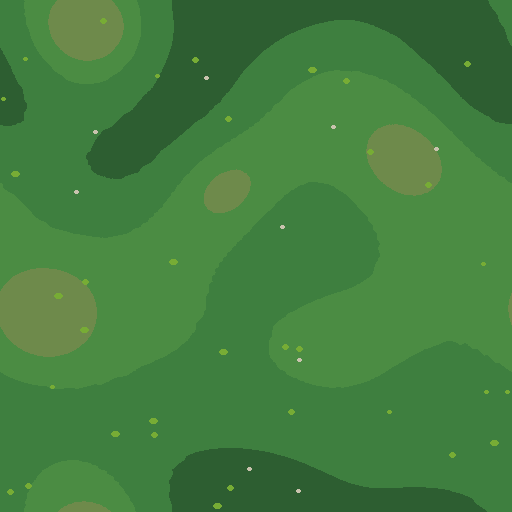

Промпт тайла — в §5 этого файла. Если переименуем в
`ground/ismaros.png` — поправить `SPRITES` в `src/ui/AssetManifest.ts`.

_Заметки:_

#### [x] `public/art/road/ismaros.png` — мощёная просёлочная дорога · тайл 128

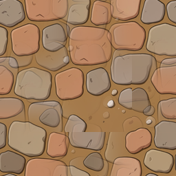

<sub>перед промптом — ПРЕАМБУЛА TILE из §5</sub>

```
Worn dirt and stone ancient Greek country road, packed warm tan-brown earth
#8C6636 with irregular flat paving stones #C99A62 and #B08550, thin dark gaps
between stones, a few pale limestone pebbles #C9C3AE at the edges, tiles
seamlessly along the long axis, 128x128.
```

_Заметки:_ Draw Things, Flux 2 Klein, 512×512 → `tools/seamless.py` до 256. Генератор рисует
текстуру, но не тайл: стык был виден, бесшовность доводится скриптом.

#### [x] `public/art/borders/ismaros.png` — сухая каменная кладка с виноградными кольями · 512×256

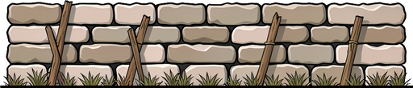

<sub>перед промптом — ПРЕАМБУЛА TILE из §5</sub>

```
Horizontal repeating border strip: a low dry-stone field wall of stacked
irregular limestone blocks #C9C3AE / #A89E86 with dark gaps #080D14, a few
weathered wooden vine stakes leaning against it, sparse dry grass #6E8A4B at its
base. Isolated strip on flat #00FF00 background, no ground beneath, tileable
left-to-right, ~55-degree top-down view, one hard light from the right, no
shadow drawn, 512x256.
```

_Заметки:_ Со второго раза. Первый заход ушёл в перспективу — стена уезжала вдаль и не
стыковалась сама с собой. Помогло прямым текстом: «perfectly horizontal, same
height at both edges, orthographic elevation, no vanishing point». Итог 512×110.

### 2.2 Пропы

#### [x] `public/art/props/vine-trellis.png` — шпалера: лоза на кольях, гроздья · в 70

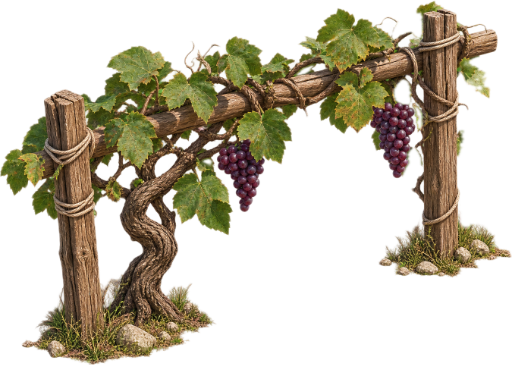

<sub>объект собирается в Blender — `ART_RUNBOOK.md`</sub>

```
A grapevine trellis section: two weathered wooden stakes with a crossbar,
gnarled vine trunk twisting up them, broad flat leaves and two dark purple
grape clusters. Waist-high to a man, wider than tall.
PALETTE: vine leaf #6E8A4B and #4B8C43, wood #88603E, grapes #5B3A5E, dry tie
cords #C9C3AE.
```

_Заметки:_ Фон чёрный, не хромакей — вырез через `tools/matte` (Vision). Под объектом
осталась запечённая земля и трава, против ISLANDS.md §1.3. Решили оставить и
чистить следующим заходом.

#### [x] `public/art/props/wine-press.png` — каменная давильня с жёлобом · ш 60

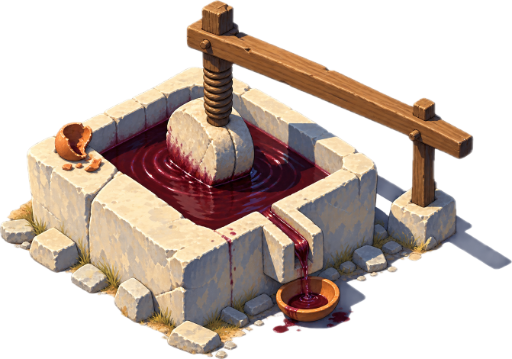

<sub>объект собирается в Blender — `ART_RUNBOOK.md`</sub>

```
A stone wine press: a square carved limestone basin with a spout, a wooden beam
across it, a shallow pool of dark wine inside, one broken clay cup on the rim.
PALETTE: limestone #E8DCC8 / #B4BCC9 / #616D8A, wood beam #88603E, wine #5B2A2E,
clay #C6743E.
```

_Заметки:_

#### [x] `public/art/props/cart-broken.png` — опрокинутая телега, колесо сорвано · ш 55

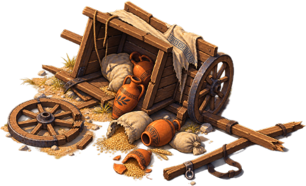

<sub>объект собирается в Blender — `ART_RUNBOOK.md`</sub>

```
An overturned ancient Greek two-wheeled ox cart: body tipped on its side, one
spoked wheel torn off and lying flat, spilled amphorae and grain sacks around
the axle, a broken yoke pole.
PALETTE: wood #88603E / #68482E / #442E1E, clay amphora #C6743E, sacking
#C9C3AE.
```

_Заметки:_

#### [x] `public/art/props/palisade-burnt.png` — обгорелый частокол, звено · в 60

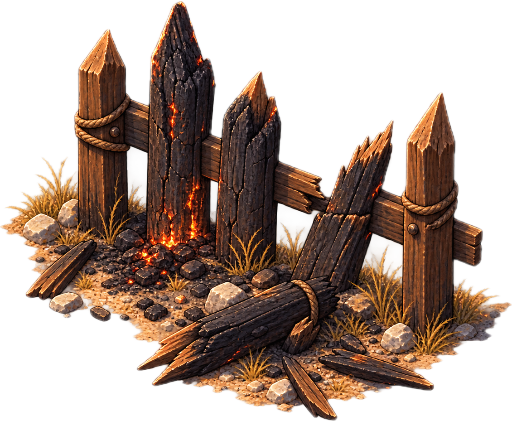

<sub>объект собирается в Blender — `ART_RUNBOOK.md`</sub>

```
A short section of a burnt wooden palisade: four or five charred sharpened
stakes, one snapped in half, blackened and cracked, faint orange embers still
glowing at the base of one stake.
PALETTE: charred wood #4A3F38 / #2A241F, unburnt wood #88603E, ember #D9762B.
```

_Заметки:_

#### [x] `public/art/props/hut-burnt.png` — сгоревшая хижина, кровля провалилась · в 85

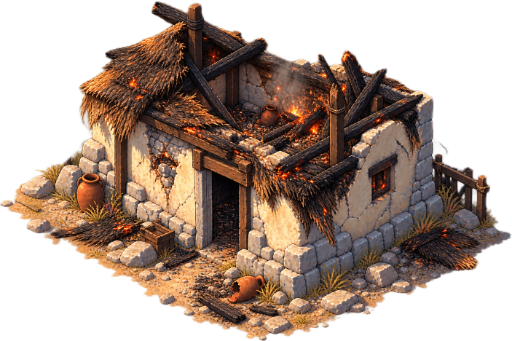

<sub>объект собирается в Blender — `ART_RUNBOOK.md`</sub>

```
A small burnt Greek village hut: stone base walls still standing, the thatched
roof collapsed inward and charred, one doorway dark and empty, a thin curl of
smoke. Twice the height of a man.
PALETTE: stone #B4BCC9 / #616D8A, charred thatch #4A3F38, ember #D9762B, cream
plaster #E8DCC8.
```

_Заметки:_

#### [ ] `public/art/props/ship-beached.png` — корабль на катках · ш 180 · **ландмарк берега**

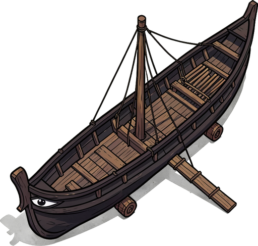

<sub>объект собирается в Blender — `ART_RUNBOOK.md`</sub>

Ландмарк. Пересобирается в Blender — `ART_RUNBOOK.md`.

_Заметки:_ Первый заход встал на песчаном пятне вопреки «no ground beneath».
Лечится отдельным абзацем NO GROUND UNDER IT и дублем в NEGATIVE.

#### [ ] `public/art/props/temple-burnt.png` — сгоревший храм · ш 200 · **ландмарк арены**

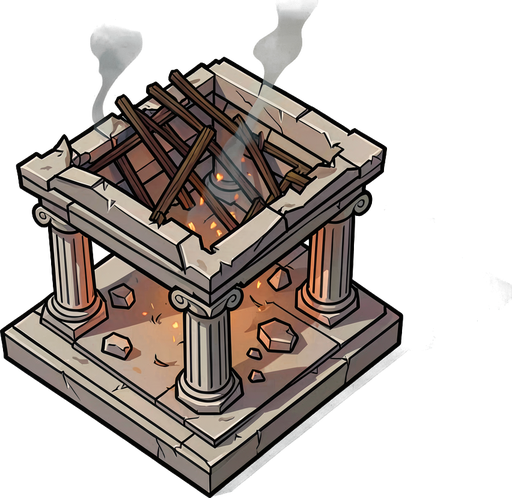

<sub>объект собирается в Blender — `ART_RUNBOOK.md`</sub>

Ландмарк, пересобирается в Blender. Ставится ВЫШЕ точки
арены, за спиной босса: арена радиусом 96, и храм в её центре закрыл бы цель.

_Заметки:_

#### [ ] Замена геометрии картинками: `column`, `column-broken`, `ruin-gate`, `rock`, `rubble`

Колонны, ворота, валуны и щебень до сих пор рисуются геометрией
(`src/ui/props/Models.ts`) и на фоне нарисованных хижины и шпалеры читаются как
серо-голубые бетонные плиты. Пересобираются в Blender — `ART_RUNBOOK.md`.

Порядок подключения из [ISLANDS.md §5.3](../ISLANDS.md#53-пропы-картинка-или-геометрия)
соблюдён: сначала один проп рядом с геометрическим, посмотреть вместе на одном
экране, и только потом остальные.

_Заметки:_

#### [ ] `public/art/entities/odysseus/club.png` — палица Одиссея

Дробящий тип до сих пор держит в руке меч (`src/ui/Figures.ts`). Жест уже свой
— замах из-за головы, — но предмет не тот. Задание `club`.

_Заметки:_

### 2.3 Враги и босс

#### [x] `public/art/entities/ismaros-normal.png` — обычный враг

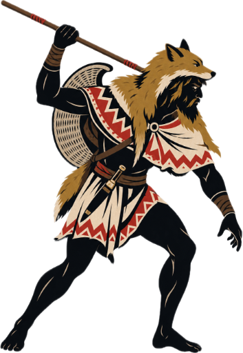

<sub>объект собирается в Blender — `ART_RUNBOOK.md`</sub>

```
A Thracian Cicone raider on foot, barefoot, wearing a short patterned woolen
cloak (zeira) with a zigzag border, a fox-skin cap with the fur outward, a small
crescent wicker pelta shield slung on his back. Lean, aggressive forward stance.
PALETTE: near-black body #080D14, cloak pattern #C4342B and #E8DCC8, fox fur
#A8843F, wicker #C9C3AE.
```

_Заметки:_

#### [x] `public/art/entities/ismaros-elite.png` — элита

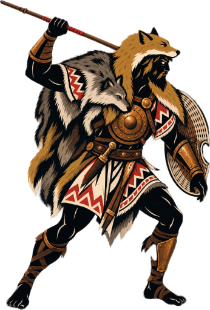

<sub>объект собирается в Blender — `ART_RUNBOOK.md`</sub>

```
Same Cicone raider family, one rank up: bronze disc breastplate and forearm
guards over the patterned cloak, a wolf pelt over one shoulder, wider heavier
build, same fox-skin cap.
PALETTE: as above plus warm bronze trim #D9762B.
```

_Заметки:_

#### [x] `public/art/entities/ismaros-miniboss.png` — мини-босс

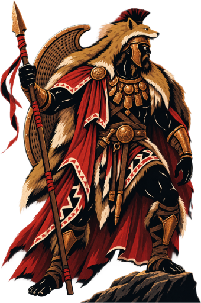

<sub>объект собирается в Blender — `ART_RUNBOOK.md`</sub>

```
Same Cicone family, war-band leader: bronze helmet with a low crest, a long
crimson cloak reaching the ground, a full-height crescent pelta on the back, a
necklace of bronze plates. Broad imposing silhouette, twice the width of the
base raider.
PALETTE: as above plus crimson #C4342B dominant on the cloak.
```

_Заметки:_

#### [x] `public/art/entities/boss-ismaros.png` — БОСС · босс, 512×512, В РУКАХ ОРУЖИЕ ЕСТЬ

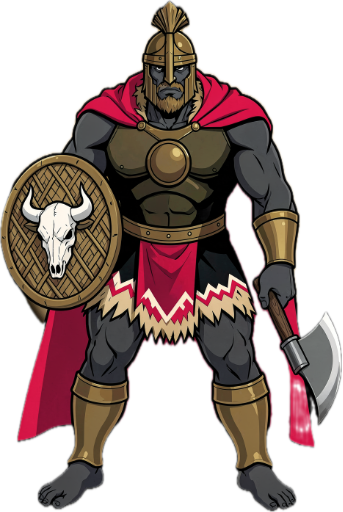

<sub>объект собирается в Blender — `ART_RUNBOOK.md`</sub>

```
Boss character: the Cicone chieftain. A huge Thracian warrior in bronze over a
raw animal hide, tall horsehair-crested bronze helmet hiding his face, a long
crimson cloak, an oval wicker shield with a real bull skull nailed to it on one
arm, a heavy double-headed axe raised in the other. Feet planted wide, shoulders
squared to the viewer, mid-swing. Monumental and readable in solid black.
PALETTE: near-black #080D14, crimson cloak #C4342B, bronze #D9762B, bone skull
#E8DCC8, wicker #C9C3AE.
```

_Заметки:_ Со второго раза. На первом Flux оторвал лезвие секиры от рукояти и повесил в
воздухе — лечится тем, что топор держат ОПУЩЕННЫМ у ноги и в промпте прямо
сказано «twin blades mounted on the very top of that haft, one single connected
weapon touching his hand».

---

#### [ ] `public/art/entities/kikon/{torso,arm,leg}.png` — детали кикона под риг

Враг до сих пор одна плоская картинка, которая наклоняется: он никогда не
машет. Движок уже умеет собирать его из частей тем же ригом, что и Одиссея
(`src/ui/rig/RigParts.ts`, `KIKON_RIG`) — не хватает только деталей. Пока их
нет, `Sprites.get` возвращает `undefined` и рисуется прежняя цельная фигура,
поэтому остров не ломается.

Костюм на острове один на все три тира ([ISLANDS.md §1.5](../ISLANDS.md#15-костюмный-контракт-врагов)),
значит детали общие: тиры различает размер фигуры и кольцо ранга под ногами.

Детали кикона пересобираются в Blender — `ART_RUNBOOK.md`. Руки и ноги генерируются
ОТДЕЛЬНО от тела и без оружия: оружие кладётся в сокет кисти движком.

_Заметки:_

## 3. РЕФЕРЕНСЫ

Сюда — всё, от чего отталкиваемся: скриншоты игр, фотографии мест, керамика,
наброски. Файлы класть в `islands/ref/ismaros/`, вставлять строкой
``.

<!--  -->

---

## 4. ЗАМЕТКИ И РЕШЕНИЯ

Что поменяли против концепции и почему; что не сработало у генератора, чтобы не
наступить второй раз.

| Дата | Что решили | Почему |
|---|---|---|
| 2026-09-03 | Фигуры и пропы взяты в портретном/изометрическом кадре на чёрном фоне, а не по преамбулам CHAR/PROP | Так их отдал ChatGPT, и вид получился сильный. Под них дописан `tools/matte.swift` — вырез системным Vision вместо хромакея |
| 2026-09-03 | Запечённые земля и тень внутри пропов оставлены | Против ISLANDS.md §1.3, но остров нужен целиком сейчас; чистим следующим заходом |
| 2026-09-03 | Дорога, граница и босс сгенерированы в Draw Things (Flux 2 Klein), локально | ChatGPT эти четыре промпта не вытянул. API Draw Things на `127.0.0.1:7860`, обычный `sdapi/v1/txt2img` |
| 2026-09-03 | Фигура рисуется по пропорции файла, а не квадратом (`ui/Body.ts`) | Кикон в портретном кадре 353×512, растянутый до квадрата, становился вдвое шире себя |
| 2026-09-03 | Заведена таблица арта по острову (`ui/IslandArt.ts`) и набор декора по острову (`world/Scenery.ts`) | Островов тринадцать, и киконы не могут делить `enemy-normal.png` с лотофагами. Следующий остров подключается одной записью |

---

## 5. ПРЕАМБУЛА ТАЙЛА

Копия из [ISLANDS.md §1.4](../ISLANDS.md#14-преамбула-промпта-для-тайла-земли) —
источник истины там, здесь для того, чтобы собирать промпт не выходя из файла.

Только земля. Объекты, фигуры и оружие собираются в Blender: порядок работы —
[ART_RUNBOOK.md](../ART_RUNBOOK.md).

```
=== ПРЕАМБУЛА TILE (земля, 512×512, бесшовный) ===
Seamless tileable top-down ground texture for a stylized mobile game,
~55-degree top-down angle, flat stylized vector-like illustration, hand-painted
mobile game art, clean flat color fills with no grain and no speckle, no visible
noise, low contrast, soft even lighting from one direction, no shadows cast by
anything, calm and uncluttered. At least 70 percent of the surface must be plain
unbroken ground. Details must be small (5-20 px on a 512 px tile) and scattered
far apart. No large objects, no focal point, no path, no road, no characters, no
text. Edges must tile seamlessly and continuously. 512x512.
NEGATIVE: noise, grain, speckle, dense texture, busy pattern, high contrast,
dark outlines, photorealistic, 3d render, gradient mesh, vignette, drop shadow,
large rocks, trees, path, road, tiled seams, borders, frame, text, watermark.
ЗАДАНИЕ: <строка объекта>
```

---

**первый остров** · [все острова](../ISLANDS.md) · [общие правила](../ISLANDS.md#1-общие-правила) · [остров 2 →](02-lotus.md)
