[← остров 1](01-ismaros.md) · [все острова](../ISLANDS.md) · [общие правила](../ISLANDS.md#1-общие-правила) · [остров 3 →](03-cyclops.md)

# ОСТРОВ 2 — ЗЕМЛЯ ЛОТОФАГОВ

> Концепция острова, слоты под картинки и промпты к ним. Общие правила — камера,
> свет, контраст, именование файлов — в [ISLANDS.md §1](../ISLANDS.md#1-общие-правила).
> Числа боя живут в `balance.json` и сюда не переносятся.
>
> **Ассетов на остров: 14.**

---

## 1. КОНЦЕПЦИЯ

**id:** `lotus` · **босс:** Страж лотоса, слабость **колющий** ·
**биом:** пустыня — дюны, солёная лагуна, лотосовые заводи

> Здесь никто не хочет драться, и это хуже драки. Твои гребцы поели лотоса и
> больше никуда не плывут.

**Вид.** Ослепительно светлый песок, ветровая рябь, полоса солончака, у которой
цвет уходит в белый. В низине — зелёно-бирюзовая заводь с лотосом, вокруг
тростник и сухие пальмы. Ни одной высокой вертикали, кроме пальм: остров
плоский и открытый, силуэты видно за два экрана. Это самый читаемый остров
маршрута и самая большая передышка перед горами.

**Палитра**

| Роль | Hex |
|---|---|
| песок основной | `#D8C08A` |
| песок в тени дюны | `#B08F5C` |
| песок на свету | `#E7D4A6` |
| солончаковая корка | `#EDE7D4` |
| вода лагуны | `#4E8F86` |
| лотос | `#C4739F` |
| сухая пальмовая зелень | `#6E7F4A` |

Розовый лотос — единственный холодный розовый во всей игре. Он оправдан ровно
здесь: это цвет наркотика, и он не должен встретиться больше нигде.

**Планировка**

```
┌────────────────┬────────────────┬────────────────┐
│ ЛОТОСОВАЯ      │ ★ ПЕРЕСОХШЕЕ   │ ПАЛЬМОВАЯ      │
│ ЗАВОДЬ         │  РУСЛО         │ РОЩА           │
│ ▲ Лотида  ◆    │  кольцо сухих  │ ▲ Мирто        │
│                │  стеблей       │ • •            │
├────────────────┼─══════════════─┼────────────────┤
│ СОЛОНЧАК       │ ТРОСТНИКОВАЯ   │ ДЮННАЯ ГРЯДА   │
│ белая корка    │ ДЕРЕВНЯ        │ шесты с лентами│
│ ▲ Дориад       │ ▲ Эвном  ◆     │ ◆  • •         │
├────────────────┼─══════════════─┼────────────────┤
│ КОСТИ У ВОДЫ   │ ◎ ОТМЕЛЬ       │ ВЫТАЩЕННАЯ     │
│ • •            │   лагуна       │ ЛОДКА          │
│                │                │ ▲ Ксут  ◆      │
└────────────────┴════════════════┴────────────────┘
```

Дорога здесь не мощёная — тропа, вытоптанная в песке, с вкраплениями битой
ракушки. Она виляет сильнее, чем на других островах: в песке прямых дорог не
бывает, и это единственный остров, где дорога подчёркнуто ненадёжная.

**Пять мини-боссов**

| Имя | Копии | Где |
|---|---|---|
| Кормчий Ксут, забывший дорогу | колющий | у вытащенной лодки |
| Сборщица Лотида | колющий | лотосовая заводь |
| Дремлющий Эвном | рубящий | тростниковая деревня |
| Чашник Дориад | рубящий | солончак |
| Толкущая Мирто | дробящий | пальмовая роща |

**Объекты**

| Файл | Размер | Что это |
|---|---|---|
| `ground/lotus.png` | тайл 512 | песок с ветровой рябью и редкой солончаковой коркой |
| `road/lotus.png` | тайл 128 | тропа в песке, битая ракушка |
| `borders/lotus.png` | 512×256 | гребень дюны с редкими выходами камня |
| `props/palm-dry.png` | в 110 | сухая финиковая пальма, листья поникли |
| `props/lotus-pool.png` | ш 120, плоский | заводь с лотосами, лежит на земле |
| `props/reed-clump.png` | в 45 | куст тростника |
| `props/reed-hut.png` | в 70 | хижина из тростника и циновок |
| `props/ox-skeleton.png` | ш 60, низкий | выбеленный скелет быка в песке |
| `props/dune-marker.png` | в 95 | шест с выцветшими лентами |
| `props/column-buried.png` | в 45 | колонна, наполовину занесённая песком |

**Враги — лотофаги**

- **Обычный (36).** Не воин. Босой человек в выцветшем льняном покрывале с
  головы до пят, венок из лотоса, глаза полузакрыты, руки опущены, идёт
  слишком плавно. Опасность читается не позой, а тем, что их много.
- **Элита (48).** Раздатчик: широкая керамическая чаша в руках, вокруг головы
  висит облачко пыльцы, покрывало с охряной каймой.
- **Мини-босс (68).** Сновидец: длинная фигура на тростниковых ходулях, лицо
  закрыто маской из сухих лепестков, покрывало волочится по песку.

**Босс — Страж лотоса** (слабость колющий)

Не человек: фигура, сплетённая из корней лотоса, тростника и наносного ила,
высотой в трёх человек. Вместо лица — маска из сухих лепестков с чёрным провалом
рта. Из плеч растут живые стебли с цветами, они шевелятся. Вместо крови — пыльца.
Слабость к колющему: тростник и корень протыкаются, а рубящий удар вязнет в
мокрой массе.

**Арена.** Пересохшее русло, обведённое кольцом сухих лотосовых стеблей выше
человека; в центре — топкая лужа, вокруг спят несколько лотофагов, которые не
проснутся, чем бы бой ни кончился.

**Трофей на корабль:** засушенный цветок лотоса на мачте.

---

## 2. АССЕТЫ — СЛОТЫ ПОД КАРТИНКИ

**Куда грузить сгенерированную картинку:** в `islands/uploads/lotus/<категория>/`,
с тем же именем файла, что написано в заголовке слота (например
`islands/uploads/lotus/props/palm-dry.png`). Категория — часть пути сразу
после `art/` в заголовке слота: `ground`, `road`, `borders`, `props` или
`entities`.

Когда файлы острова лежат в `uploads/lotus/`, один раз прогнать:

```
python3 tools/import-island-art.py lotus
```

Он сам решит, резать ли зелёный фон (`props`/`entities`/`borders` — да, `ground`/`road`
— нет, это бесшовные тайлы без хромакея), и разложит результат по `public/art/`.
Исходники в `uploads/` не удаляются — пересобрать можно без похода в ChatGPT заново.

Под каждым слотом ниже: превью (подтянется само, как только файл окажется в
`public/art/`), готовый промпт и строка для заметок. Перед промптом вставить
преамбулу своего вида — они лежат в §5 этого же файла. Отметку `[ ]` менять на
`[x]`, когда файл прошёл четыре проверки приёмки
([ISLANDS.md §4](../ISLANDS.md#4-чек-лист-генерации)).

### 2.1 Земля, дорога, граница

#### [ ] `public/art/ground/lotus.png` — песок с ветровой рябью и редкой солончаковой коркой · тайл 512

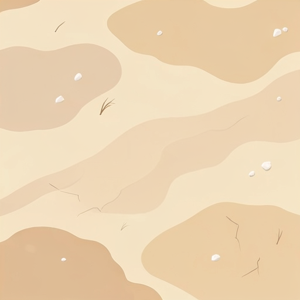

<sub>перед промптом — ПРЕАМБУЛА TILE из §5</sub>

```
Pale sun-bleached North African desert sand with soft wind ripples, mostly flat
warm sand as a calm background, gentle large soft patches of lighter and darker
sand, very sparse tiny details only: a few small pale salt-crust flakes, a couple
of tiny dry reed fragments, one or two faint hard-baked cracks. No dunes, no
footprints, no vegetation.
PALETTE: sand #D8C08A dominant, shadow sand #B08F5C, light sand #E7D4A6, salt
crust #EDE7D4, rare dry reed #6E7F4A.
```

_Заметки:_

#### [ ] `public/art/road/lotus.png` — тропа в песке, битая ракушка · тайл 128

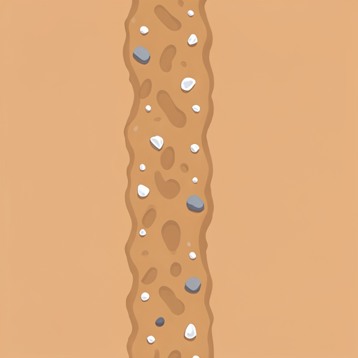

<sub>перед промптом — ПРЕАМБУЛА TILE из §5</sub>

```
A footpath trampled into desert sand: slightly darker packed sand #C2A672 with a
scatter of crushed white shell fragments #EDE7D4 and a few small pebbles, soft
irregular edges, tiles seamlessly along the long axis, 128x128.
```

_Заметки:_

#### [ ] `public/art/borders/lotus.png` — гребень дюны с редкими выходами камня · 512×256

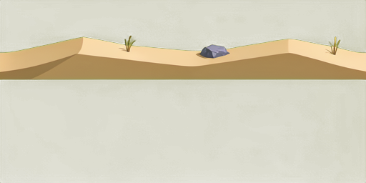

<sub>перед промптом — ПРЕАМБУЛА TILE из §5</sub>

```
Horizontal repeating border strip: the crest of a sand dune seen from above,
a soft wind-carved ridge with a sharp shadow line along its lee side, two small
weathered rock outcrops breaking through, a few dry reed tufts. Isolated strip on
flat #00FF00, no ground beneath, tileable left-to-right, ~55-degree top-down, one
hard light from the right, no shadow drawn, 512x256.
PALETTE: sand #D8C08A, lee shadow #B08F5C, lit crest #E7D4A6, rock #8B97B4.
```

_Заметки:_

### 2.2 Пропы

#### [ ] `public/art/props/palm-dry.png` — сухая финиковая пальма, листья поникли · в 110

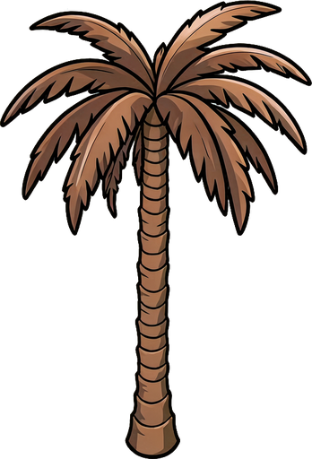

<sub>объект собирается в Blender — `ART_RUNBOOK.md`</sub>

```
A single dry date palm: a slender leaning trunk of stacked fibrous rings, a crown
of long drooping fronds, half of them brown and dead, one broken frond hanging.
Tall and thin, three times the height of a man.
PALETTE: trunk #9C7B4A / #68482E, live frond #6E7F4A, dead frond #A8843F, cream
highlight #E8DCC8.
```

_Заметки:_

#### [ ] `public/art/props/lotus-pool.png` — заводь с лотосами, лежит на земле · ш 120, плоский

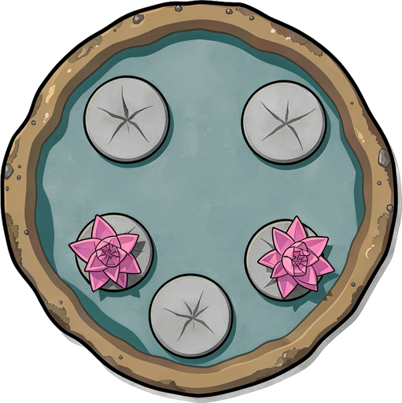

<sub>объект собирается в Blender — `ART_RUNBOOK.md`</sub>

```
A shallow lotus pool seen from directly above, lying FLAT on the ground: an
irregular pond of still green-teal water, five or six round flat lotus pads and
three open pink lotus flowers, a muddy salt-crusted rim. Completely flat, no
height, no vertical elements.
PALETTE: water #4E8F86 and darker #2F6A63, pads #6E7F4A, flowers #C4739F, rim
#EDE7D4.
```

_Заметки:_

#### [ ] `public/art/props/reed-clump.png` — куст тростника · в 45

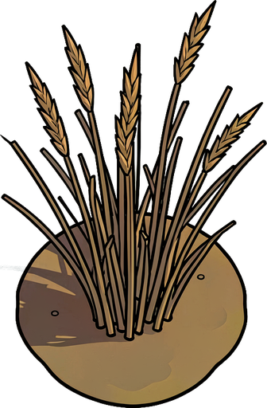

<sub>объект собирается в Blender — `ART_RUNBOOK.md`</sub>

```
A clump of tall desert reeds growing from a small muddy patch, thin vertical
stalks with feathered tips, some bent and broken, waist-high to a man.
PALETTE: reed #6E7F4A / #4E5C36, dry tips #C9A94E, mud #B08F5C.
```

_Заметки:_

#### [ ] `public/art/props/reed-hut.png` — хижина из тростника и циновок · в 70

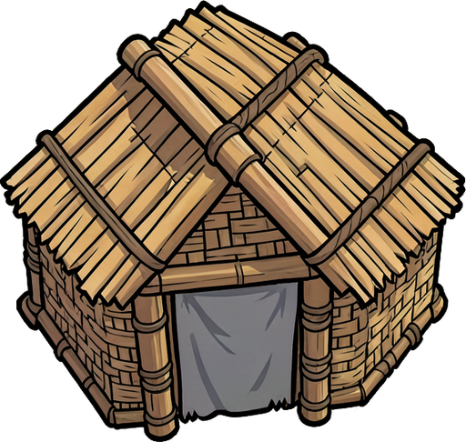

<sub>объект собирается в Blender — `ART_RUNBOOK.md`</sub>

```
A small hut woven from reed bundles and woven mats over a bent frame, low and
rounded, one dark doorway hung with a faded cloth, mats fraying at the corners.
PALETTE: reed #C9A94E / #9C7B4A, shadow #68482E, faded cloth #EDE7D4, rope
#C9C3AE.
```

_Заметки:_

#### [ ] `public/art/props/ox-skeleton.png` — выбеленный скелет быка в песке · ш 60, низкий

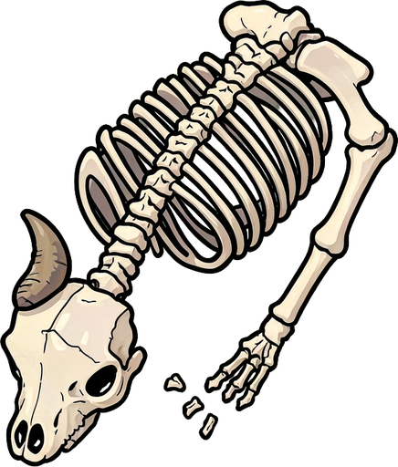

<sub>объект собирается в Blender — `ART_RUNBOOK.md`</sub>

```
A sun-bleached ox skeleton half sunk in sand, seen from above: ribcage arching
up, long skull with horns lying to one side, a few scattered vertebrae. Low, wide,
barely above the ground.
PALETTE: bleached bone #EDE7D4 / #C9C3AE, deep shadow inside ribs #8B7B5A.
```

_Заметки:_

#### [ ] `public/art/props/dune-marker.png` — шест с выцветшими лентами · в 95

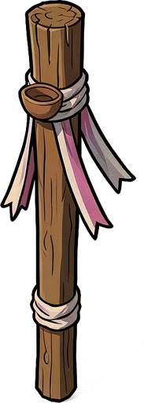

<sub>объект собирается в Blender — `ART_RUNBOOK.md`</sub>

```
A tall weathered wooden pole planted in sand, wrapped with faded cloth ribbons
that hang limp in still air, a small clay bowl tied near the top. Taller than a
man, very thin.
PALETTE: wood #9C7B4A, ribbons #EDE7D4 and faded #C4739F, clay #C6743E.
```

_Заметки:_

#### [ ] `public/art/props/column-buried.png` — колонна, наполовину занесённая песком · в 45

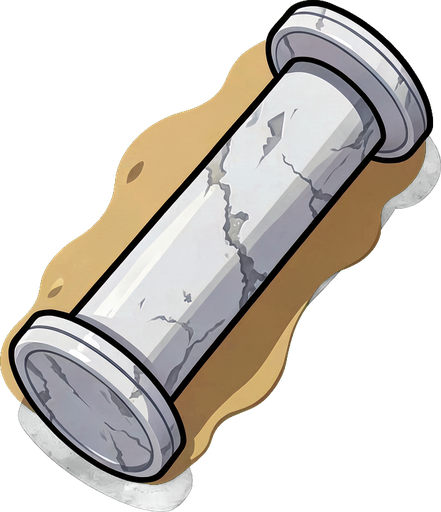

<sub>объект собирается в Blender — `ART_RUNBOOK.md`</sub>

```
An ancient Greek marble column lying on its side, half buried in drifted sand,
only its upper half and the capital showing, surface pitted by wind.
PALETTE: marble #E8DCC8 / #B4BCC9 / #616D8A, sand drift #D8C08A.
```

_Заметки:_

### 2.3 Враги и босс

#### [ ] `public/art/entities/lotus-normal.png` — обычный враг

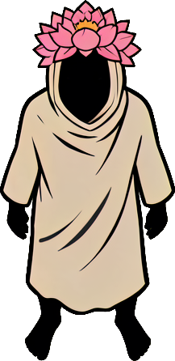

<sub>объект собирается в Blender — `ART_RUNBOOK.md`</sub>

```
A lotus-eater: a barefoot figure wrapped head to foot in a pale bleached linen
shroud, a wreath of pink lotus flowers on the head, eyes half closed, arms hanging
loose, standing far too calmly. Serene, slow, unsettling — not a warrior.
PALETTE: near-black body #080D14, linen #EDE7D4, lotus #C4739F, dull ochre trim
#A8843F.
```

_Заметки:_

#### [ ] `public/art/entities/lotus-elite.png` — элита


<sub>объект собирается в Blender — `ART_RUNBOOK.md`</sub>

```
Same lotus-eater family, one rank up: holding a wide ceramic bowl at the waist, a
faint cloud of pollen hanging around the head, the linen shroud edged with ochre,
a heavier build.
PALETTE: as above plus clay bowl #C6743E and pollen haze #E7D4A6.
```

_Заметки:_

#### [ ] `public/art/entities/lotus-miniboss.png` — мини-босс

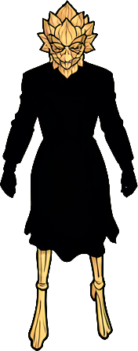

<sub>объект собирается в Blender — `ART_RUNBOOK.md`</sub>

```
Same family, the Dreamer: a tall stilted figure walking on reed stilts, its face
hidden behind a mask of dried lotus petals, the linen shroud trailing on the
ground, twice the height and width of the base figure.
PALETTE: as above plus reed stilts #C9A94E.
```

_Заметки:_

#### [ ] `public/art/entities/boss-lotus.png` — БОСС

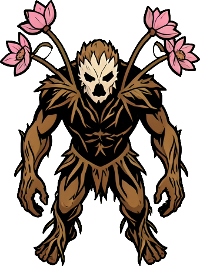

<sub>объект собирается в Blender — `ART_RUNBOOK.md`</sub>

```
Boss character: the Lotus Warden. A towering humanoid woven from lotus roots,
river reeds and dried silt, three men tall, no face — only a mask of dried petals
with a black hollow mouth. Living lotus stalks with open flowers grow out of its
shoulders and sway. Long root-fingered arms hanging low, hunched forward. Body
looks waterlogged and heavy.
PALETTE: near-black #080D14, root brown #68482E, reed #6E7F4A, dried petal mask
#EDE7D4, lotus pink #C4739F, silt #B08F5C.
```

_Заметки:_

---

## 3. РЕФЕРЕНСЫ

Сюда — всё, от чего отталкиваемся: скриншоты игр, фотографии мест, керамика,
наброски. Файлы класть в `islands/ref/lotus/`, вставлять строкой
``.

<!--  -->

---

## 4. ЗАМЕТКИ И РЕШЕНИЯ

Что поменяли против концепции и почему; что не сработало у генератора, чтобы не
наступить второй раз.

| Дата | Что решили | Почему |
|---|---|---|
|  |  |  |

---

## 5. ПРЕАМБУЛА ТАЙЛА

Копия из [ISLANDS.md §1.4](../ISLANDS.md#14-преамбула-промпта-для-тайла-земли) —
источник истины там, здесь для того, чтобы собирать промпт не выходя из файла.

Только земля. Объекты, фигуры и оружие собираются в Blender: порядок работы —
[ART_RUNBOOK.md](../ART_RUNBOOK.md).

```
=== ПРЕАМБУЛА TILE (земля, 512×512, бесшовный) ===
Seamless tileable top-down ground texture for a stylized mobile game,
~55-degree top-down angle, flat stylized vector-like illustration, hand-painted
mobile game art, clean flat color fills with no grain and no speckle, no visible
noise, low contrast, soft even lighting from one direction, no shadows cast by
anything, calm and uncluttered. At least 70 percent of the surface must be plain
unbroken ground. Details must be small (5-20 px on a 512 px tile) and scattered
far apart. No large objects, no focal point, no path, no road, no characters, no
text. Edges must tile seamlessly and continuously. 512x512.
NEGATIVE: noise, grain, speckle, dense texture, busy pattern, high contrast,
dark outlines, photorealistic, 3d render, gradient mesh, vignette, drop shadow,
large rocks, trees, path, road, tiled seams, borders, frame, text, watermark.
ЗАДАНИЕ: <строка объекта>
```

---

[← остров 1](01-ismaros.md) · [все острова](../ISLANDS.md) · [общие правила](../ISLANDS.md#1-общие-правила) · [остров 3 →](03-cyclops.md)
