[← остров 2](02-lotus.md) · [все острова](../ISLANDS.md) · [общие правила](../ISLANDS.md#1-общие-правила) · [остров 4 →](04-aeolia.md)

# ОСТРОВ 3 — ОСТРОВ ЦИКЛОПОВ

> Концепция острова, слоты под картинки и промпты к ним. Общие правила — камера,
> свет, контраст, именование файлов — в [ISLANDS.md §1](../ISLANDS.md#1-общие-правила).
> Числа боя живут в `balance.json` и сюда не переносятся.
>
> **Ассетов на остров: 13.**

---

## 1. КОНЦЕПЦИЯ

**id:** `cyclops` · **босс:** Полифем, слабость **дробящий** ·
**биом:** горы — чёрный базальт, жёсткое горное пастбище, пещеры

> Всё здесь на размер больше, чем нужно человеку. Следы, загоны, посуда, дверь.

**Вид.** Крутой чёрный склон уступами, между камнями — жёсткая тёмная трава.
Загоны сложены из валунов в человеческий рост. По уступам разбросаны кости и
шерсть. Наверху — устье пещеры с валуном-затвором, из которого тянет дымом.
Первый остров с настоящей вертикалью: базальтовые столбы и стены загонов режут
пространство, и врага впервые может быть не видно из-за камня. Загоны ставятся
так, чтобы ни один узел не был полностью закрыт.

**Палитра**

| Роль | Hex |
|---|---|
| базальт | `#3E434C` |
| горная трава | `#35603C` |
| трава в тени | `#26472C` |
| пепел и щебень | `#7A756B` |
| кость и шерсть | `#E8DCC8` |
| лавовая жила | `#D9762B` |

**Планировка**

```
┌────────────────┬────────────────┬────────────────┐
│ СЫРОВАРНЯ      │ ★ УСТЬЕ ПЕЩЕРЫ │ КОСТРИЩЕ       │
│ формы и кадки  │  валун-затвор  │ ВЕЛИКАНА       │
│ ▲ Аргет  ◆     │  сбоку         │ вертел, кости  │
│                │                │ ▲ Бронт  ◆     │
├────────────────┼─══════════════─┼────────────────┤
│ КАМЕННЫЙ ЗАГОН │ ТРОПА СТАДА    │ УСТУП НАД      │
│ стены в рост   │ между валунами │ МОРЕМ          │
│ ▲ Полибот      │ • • • •        │ ▲ Стероп  ◆    │
├────────────────┼─══════════════─┼────────────────┤
│ КОСТИ И ОБЛОМКИ│ ◎ ЧЁРНЫЙ ПЕСОК │ ЛАВОВАЯ ЖИЛА   │
│ ЛОДОК          │   бухты        │ дым из трещин  │
│ • •            │                │ ▲ Гарпаг  ◆    │
└────────────────┴════════════════┴────────────────┘
```

Дороги как таковой нет — есть тропа, выбитая копытами стада: вдавленный щебень
между валунами. Она узкая и петляет: это первый остров, где путь наверх не
очевиден, и это нарочно.

**Пять мини-боссов**

| Имя | Копии | Где |
|---|---|---|
| Бронт Валун | дробящий | кострище великана |
| Стероп Пращник | дробящий | уступ над морем |
| Аргет Сырорез | рубящий | сыроварня |
| Полибот Острога | колющий | каменный загон |
| Гарпаг Дымный | колющий | лавовая жила |

**Объекты**

| Файл | Размер | Что это |
|---|---|---|
| `ground/cyclops.png` | тайл 512 | чёрный базальтовый гравий с жёсткой тёмной травой |
| `road/cyclops.png` | тайл 128 | вдавленный щебень тропы стада |
| `borders/cyclops.png` | 512×256 | стена из шестигранных базальтовых столбов |
| `props/boulder-pen.png` | в 95 | звено загона из валунов, выше игрока |
| `props/cave-mouth.png` | в 180 | устье пещеры с валуном-затвором, ландмарк арены |
| `props/cheese-rack.png` | в 60 | стойка с сырными формами размером с человека |
| `props/bone-pile.png` | ш 70 | куча костей и черепов баранов |
| `props/pine-club.png` | ш 130, лежит | брошенная дубина из ствола сосны |
| `props/basalt-columns.png` | в 100 | группа шестигранных базальтовых столбов |

**Враги — циклопы-пастухи** (младшая родня Полифема)

- **Обычный (36).** Приземистый одноглазый пастух: сырая овечья шкура через
  плечо мехом наружу, косматая борода, босые ноги, на поясе кожаная праща с
  камнями. Единственный глаз — светлое пятно на чёрном лице, читается издалека.
- **Элита (48).** Тот же, но с валуном на плече и в поясе из бараньих черепов,
  плечи выше головы.
- **Мини-босс (68).** Загонщик: шкура целиком, посох в полтора роста, ожерелье
  из бараньих рогов, ноги обмотаны шкурой.

**Босс — Полифем** (слабость дробящий)

Гора мяса и шерсти, вдвое выше любого мини-босса. Сырая баранья шкура, ожерелье
из черепов, дубина из ствола оливы в руке. Лицо почти всё в тени, и на нём —
единственный глаз, светлый и мокрый, самое яркое пятно на всём острове. Он
слепнет позже, в бою глаз ещё цел, и он должен работать как мишень: игрок
смотрит именно туда. Слабость к дробящему прямая — камень и кость дробят, а не
режут.

**Арена.** Пол пещеры: круг вытоптанной земли, у края — валун-затвор высотой в
два игрока, вдоль стен загоны с овцами, посреди — кострище с вертелом.

**Трофей на корабль:** глаз циклопа на форштевень (GDD §8).

---

## 2. АССЕТЫ — СЛОТЫ ПОД КАРТИНКИ

**Куда грузить сгенерированную картинку:** в `islands/uploads/cyclops/<категория>/`,
с тем же именем файла, что написано в заголовке слота (например
`islands/uploads/cyclops/props/boulder-pen.png`). Категория — часть пути сразу
после `art/` в заголовке слота: `ground`, `road`, `borders`, `props` или
`entities`.

Когда файлы острова лежат в `uploads/cyclops/`, один раз прогнать:

```
python3 tools/import-island-art.py cyclops
```

Он сам решит, резать ли зелёный фон (`props`/`entities`/`borders` — да, `ground`/`road`
— нет, это бесшовные тайлы без хромакея), и разложит результат по `public/art/`.
Исходники в `uploads/` не удаляются — пересобрать можно без похода в ChatGPT заново.

Под каждым слотом ниже: превью (подтянется само, как только файл окажется в
`public/art/`), готовый промпт и строка для заметок. Перед промптом вставить
преамбулу своего вида — они лежат в §5 этого же файла. Отметку `[ ]` менять на
`[x]`, когда файл прошёл четыре проверки приёмки
([ISLANDS.md §4](../ISLANDS.md#4-чек-лист-генерации)).

### 2.1 Земля, дорога, граница

#### [ ] `public/art/ground/cyclops.png` — чёрный базальтовый гравий с жёсткой тёмной травой · тайл 512

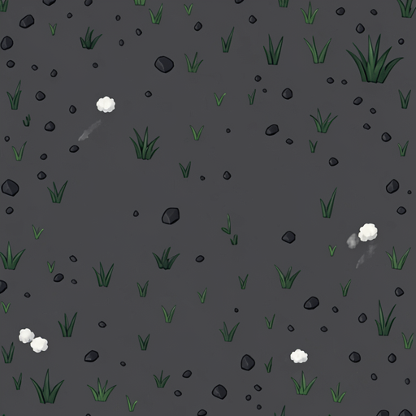

<sub>перед промптом — ПРЕАМБУЛА TILE из §5</sub>

```
Volcanic mountain pasture: dark basalt gravel and bare rock as the calm base,
with large soft patches of tough dark mountain grass, very sparse tiny details
only: a few small angular black stones, a couple of tiny tufts of sheep wool
caught on the ground, one faint ash smear. No boulders, no plants taller than
grass.
PALETTE: basalt #3E434C and grass #35603C sharing dominance, grass shadow
#26472C, ash grey #7A756B, rare bone-white fleck #E8DCC8.
```

_Заметки:_

#### [ ] `public/art/road/cyclops.png` — вдавленный щебень тропы стада · тайл 128

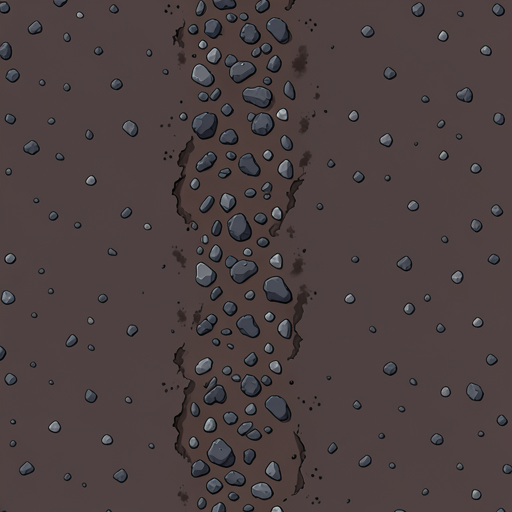

<sub>перед промптом — ПРЕАМБУЛА TILE из §5</sub>

```
A herd trail beaten into volcanic ground: crushed dark gravel pressed flat
#55575E with lighter stone chips #7A756B, scattered hoof-scuffed dust, ragged
irregular edges, tiles seamlessly along the long axis, 128x128.
```

_Заметки:_

#### [ ] `public/art/borders/cyclops.png` — стена из шестигранных базальтовых столбов · 512×256

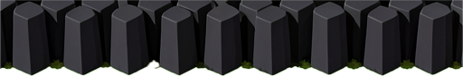

<sub>перед промптом — ПРЕАМБУЛА TILE из §5</sub>

```
Horizontal repeating border strip: a wall of tall hexagonal basalt columns of
uneven heights packed shoulder to shoulder, their flat tops visible, deep black
gaps between them, a little dark moss at the base. Isolated strip on flat
#00FF00, no ground beneath, tileable left-to-right, ~55-degree top-down, one hard
light from the right, no shadow drawn, 512x256.
PALETTE: basalt #3E434C / #55575E / #23262C, moss #26472C.
```

_Заметки:_

### 2.2 Пропы

#### [ ] `public/art/props/boulder-pen.png` — звено загона из валунов, выше игрока · в 95

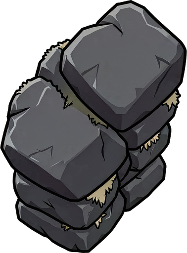

<sub>перед промптом — ПРЕАМБУЛА PROP из §5</sub>

```
A section of a giant's sheepfold wall: huge rough boulders stacked without
mortar, taller than a man, one boulder tilted and about to fall, dark gaps
between the stones, dry wool snagged on an edge.
PALETTE: basalt #3E434C / #55575E / #23262C, wool #E8DCC8, moss #26472C.
```

_Заметки:_

#### [ ] `public/art/props/cave-mouth.png` — устье пещеры с валуном-затвором, ландмарк арены · в 180

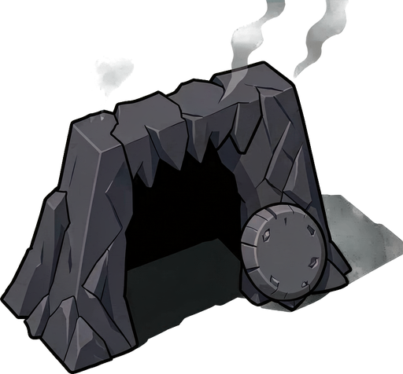

<sub>перед промптом — ПРЕАМБУЛА PROP из §5</sub>

```
A giant cave entrance in a volcanic cliff face: a wide black opening twice the
height of a man, jagged rock lintel above it, a colossal round door-stone leaning
beside the opening, thin smoke drifting out of the dark. Monumental landmark
object, wider than tall.
PALETTE: basalt #3E434C / #55575E / #23262C, black interior #080D14, smoke
#7A756B, faint ember glow #D9762B deep inside.
```

_Заметки:_

#### [ ] `public/art/props/cheese-rack.png` — стойка с сырными формами размером с человека · в 60

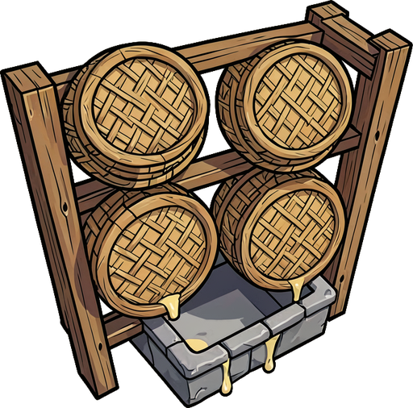

<sub>перед промптом — ПРЕАМБУЛА PROP из §5</sub>

```
A giant's cheese rack: a crude timber frame holding four round wicker cheese
moulds each the size of a man's torso, whey dripping into a stone trough below.
PALETTE: timber #68482E, wicker #C9A94E, cheese #E8DCC8, stone trough #55575E.
```

_Заметки:_

#### [ ] `public/art/props/bone-pile.png` — куча костей и черепов баранов · ш 70

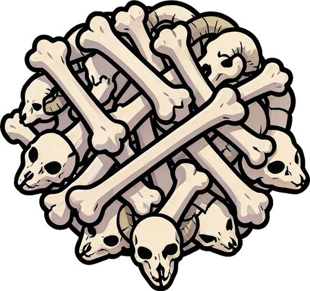

<sub>перед промптом — ПРЕАМБУЛА PROP из §5</sub>

```
A pile of ram and sheep bones and horned skulls, picked clean, heaped low and
wide, a couple of long bones cracked open.
PALETTE: bone #E8DCC8 / #C9C3AE, deep shadow #23262C, dry blood stain #6B3A32.
```

_Заметки:_

#### [ ] `public/art/props/pine-club.png` — брошенная дубина из ствола сосны · ш 130, лежит

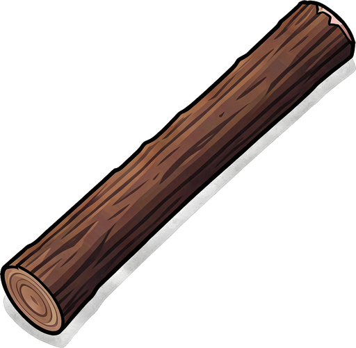

<sub>перед промптом — ПРЕАМБУЛА PROP из §5</sub>

```
An enormous club made from a whole pine trunk, lying flat on the ground, bark
still on it, roots hacked off at the thick end, the grip end worn smooth and
dark. Far longer than a man is tall.
PALETTE: bark #68482E / #442E1E, stripped wood #9C7B4A, worn grip #23262C.
```

_Заметки:_

#### [ ] `public/art/props/basalt-columns.png` — группа шестигранных базальтовых столбов · в 100

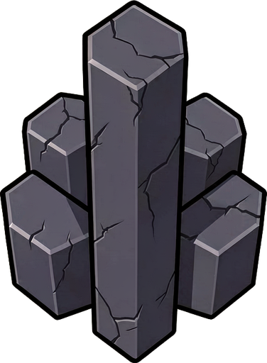

<sub>перед промптом — ПРЕАМБУЛА PROP из §5</sub>

```
A cluster of five or six hexagonal basalt columns of different heights rising
from the ground, sharp flat tops clearly visible, cracked faces, tallest slightly
above a man's height.
PALETTE: basalt #3E434C / #55575E / #23262C, faint lichen #6E8A4B.
```

_Заметки:_

### 2.3 Враги и босс

#### [ ] `public/art/entities/cyclops-normal.png` — обычный враг

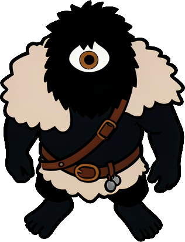

<sub>перед промптом — ПРЕАМБУЛА CHAR из §5</sub>

```
A young cyclops shepherd: squat and heavy, ONE large eye in the middle of the
forehead, matted beard, a raw sheepskin thrown over one shoulder fleece outward,
barefoot, a leather sling with stones hanging from the belt. The single eye is the
lightest point on the whole figure.
PALETTE: near-black body #080D14, fleece #E8DCC8, hide #68482E, eye #E8DCC8 with
a dark pupil, sling leather #442E1E.
```

_Заметки:_

#### [ ] `public/art/entities/cyclops-elite.png` — элита

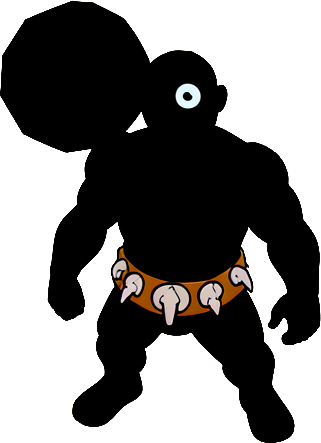

<sub>перед промптом — ПРЕАМБУЛА CHAR из §5</sub>

```
Same cyclops family, one rank up: a boulder hoisted on one shoulder, a belt of
ram skulls, shoulders higher than the head, thicker limbs, same single eye and
fleece.
PALETTE: as above plus bone #C9C3AE and warm trim #D9762B on the belt.
```

_Заметки:_

#### [ ] `public/art/entities/cyclops-miniboss.png` — мини-босс

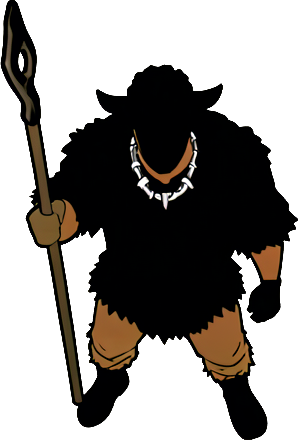

<sub>перед промптом — ПРЕАМБУЛА CHAR из §5</sub>

```
Same family, the herd-driver: a full sheep hide worn as a cloak, a staff one and
a half times his own height held upright, a necklace of ram horns, legs wrapped
in hide, twice the bulk of the base shepherd.
PALETTE: as above.
```

_Заметки:_

#### [ ] `public/art/entities/boss-cyclops.png` — БОСС

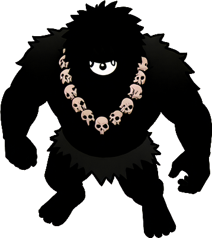

<sub>перед промптом — ПРЕАМБУЛА CHAR из §5</sub>

```
Boss character: Polyphemus. A colossal one-eyed cyclops, a mountain of muscle and
matted hair, twice the bulk of any other figure, wearing a raw ram hide and a
necklace of skulls, gripping a club made from a whole olive trunk. His face is
almost entirely in shadow except the single huge eye — wet, pale and catching the
light, the brightest point in the image. Hunched forward, one hand reaching, mid
step.
PALETTE: near-black #080D14, fleece and eye #E8DCC8, hide #68482E, bone #C9C3AE,
ember warmth #D9762B. Max 6 colors.
```

_Заметки:_

---

## 3. РЕФЕРЕНСЫ

Сюда — всё, от чего отталкиваемся: скриншоты игр, фотографии мест, керамика,
наброски. Файлы класть в `islands/ref/cyclops/`, вставлять строкой
``.

<!--  -->

---

## 4. ЗАМЕТКИ И РЕШЕНИЯ

Что поменяли против концепции и почему; что не сработало у генератора, чтобы не
наступить второй раз.

| Дата | Что решили | Почему |
|---|---|---|
|  |  |  |

---

## 5. ПРЕАМБУЛЫ

Копия из [ISLANDS.md §1.4](../ISLANDS.md#14-три-преамбулы-промптов) — источник
истины там, здесь для того, чтобы собирать промпт не выходя из файла.

```
=== ПРЕАМБУЛА TILE (земля, 512×512, бесшовный) ===
Seamless tileable top-down ground texture for a stylized mobile game,
~55-degree top-down angle, flat stylized vector-like illustration, hand-painted
mobile game art, clean flat color fills with no grain and no speckle, no visible
noise, low contrast, soft even lighting from one direction, no shadows cast by
anything, calm and uncluttered. At least 70 percent of the surface must be plain
unbroken ground. Details must be small (5-20 px on a 512 px tile) and scattered
far apart. No large objects, no focal point, no path, no road, no characters, no
text. Edges must tile seamlessly and continuously. 512x512.
NEGATIVE: noise, grain, speckle, dense texture, busy pattern, high contrast,
dark outlines, photorealistic, 3d render, gradient mesh, vignette, drop shadow,
large rocks, trees, path, road, tiled seams, borders, frame, text, watermark.
ЗАДАНИЕ: <строка объекта>
```

```
=== ПРЕАМБУЛА PROP (объект мира, 1024×1024) ===
Top-down mobile game prop, single isolated object.
CAMERA: fixed 55-degree top-down three-quarter view, as in a mobile action RPG.
The viewer looks DOWN at the object from above and slightly in front; top faces
are clearly visible. Orthographic projection, no lens perspective, no vanishing
point, no wide-angle distortion, no eye-level view.
LIGHT: exactly one hard light source from the RIGHT and slightly toward the
viewer. Lit faces point right and down-screen, shaded faces point left and
up-screen. Consistent across every surface.
NO SHADOW: do not draw any shadow on the ground. No drop shadow, no contact
shadow, no cast shadow, no dark ellipse, no blur under the object. Nothing
beneath it at all. Shading ON the object itself is fine.
BACKGROUND: completely flat uniform pure chroma green #00FF00, edge to edge. No
gradient, no texture, no ground, no grass, no horizon, no scenery. Absolutely no
green of any kind anywhere on the object itself.
OUTLINE: a clean, closed, continuous near-black outline #080D14, 6-8 px thick,
tracing the entire outer silhouette where it meets the background, including
inner openings. No fuzzy edges, no glow, no feathering.
STYLE: flat stylized vector illustration, bold clean shapes, hard-edged flat
color fills, 3-4 tones per material (light / mid / dark). No gradients, no
airbrush, no photorealism, no 3D render, no ambient occlusion, no specular
highlights, no noise texture.
FRAMING: object centered horizontally, filling ~90% of the frame. Its base sits
exactly on the bottom edge of the image, no empty margin below the base.
Square image 1024x1024. No text, no watermark, no logo, no UI, no border frame.
ЗАДАНИЕ: <строка объекта> · PALETTE: <палитра острова>
```

```
=== ПРЕАМБУЛА CHAR (фигура, 512×512) ===
Top-down mobile game character sprite, single figure, centered.
CAMERA / LIGHT / NO SHADOW / BACKGROUND / OUTLINE / STYLE: identical to the PROP
preamble above (55-degree top-down three-quarter, one hard light from the right
and slightly toward the viewer, no shadow drawn, flat #00FF00 background, closed
#080D14 outline, flat vector fills).
POSE: standing, weight forward, aggressive readable stance, seen from above and
slightly in front — head, shoulders and both feet clearly visible.
FRAMING: the figure fills ~85% of a SQUARE frame, feet touching the bottom edge,
centered horizontally.
HANDS EMPTY: no weapon in the hands — the weapon is a separate overlay drawn by
the engine. Sheathed weapons, quivers and shields on the back are fine.
COLOR LIMIT: no more than 6 colors total. The silhouette must stay recognizable
when filled with solid black.
512x512.
ЗАДАНИЕ: <строка объекта> · PALETTE: <палитра острова>
```

---

[← остров 2](02-lotus.md) · [все острова](../ISLANDS.md) · [общие правила](../ISLANDS.md#1-общие-правила) · [остров 4 →](04-aeolia.md)
